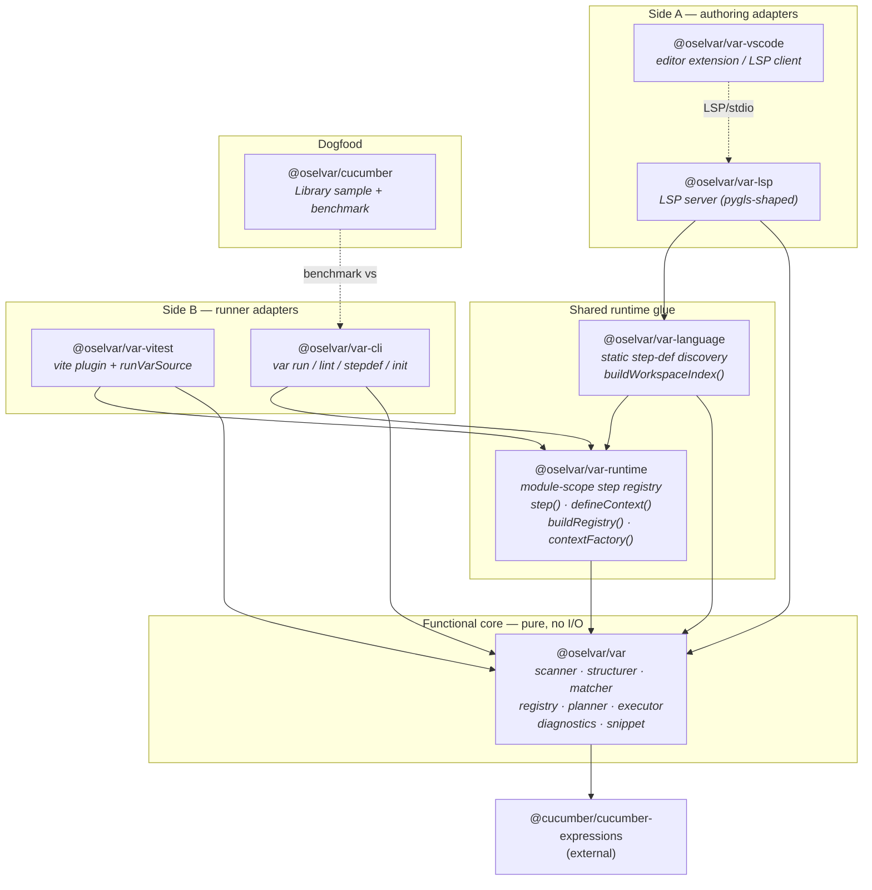
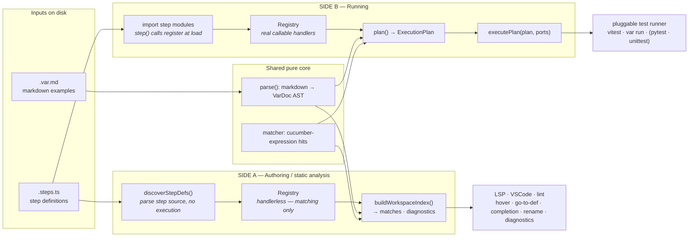
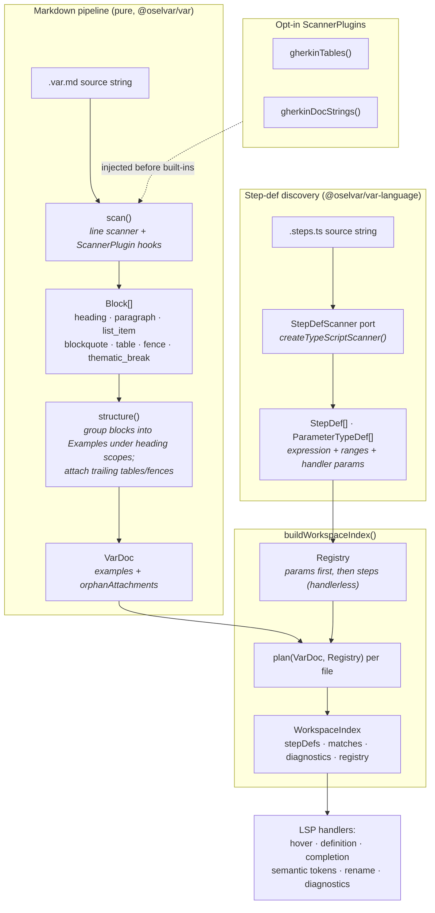
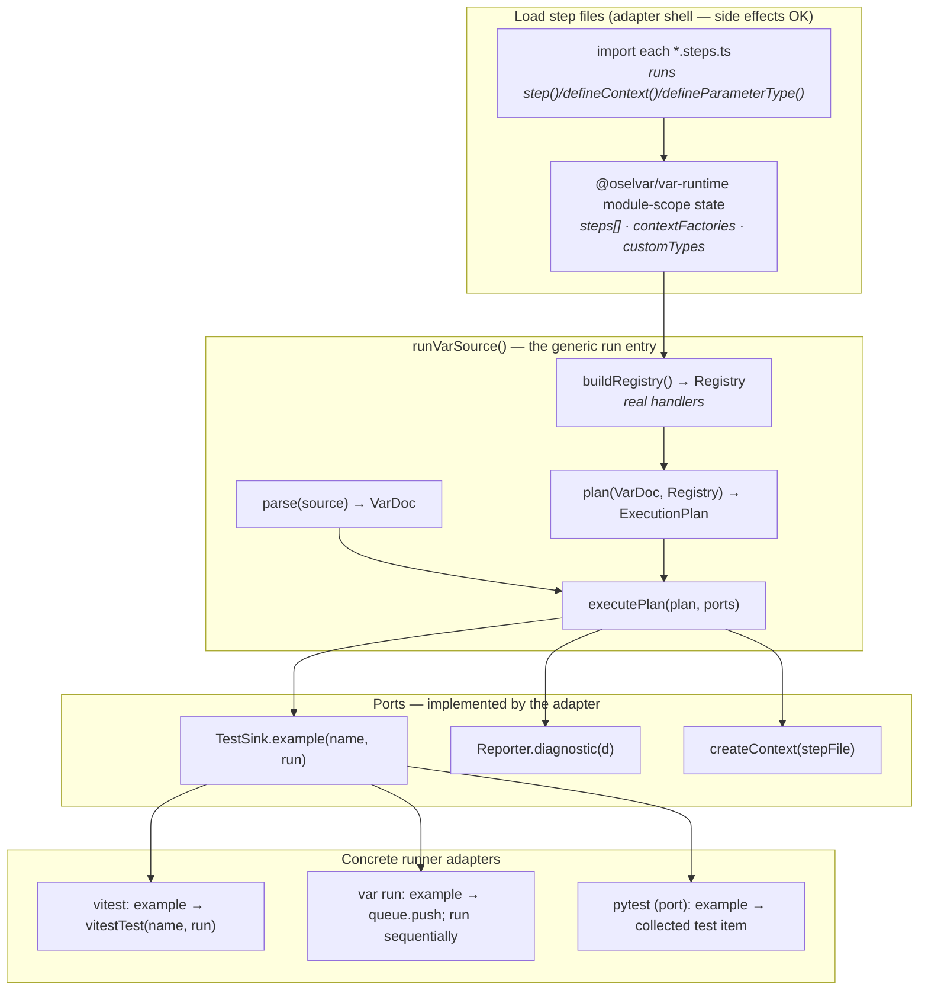
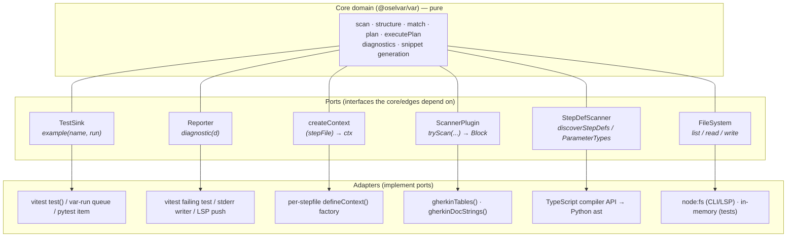
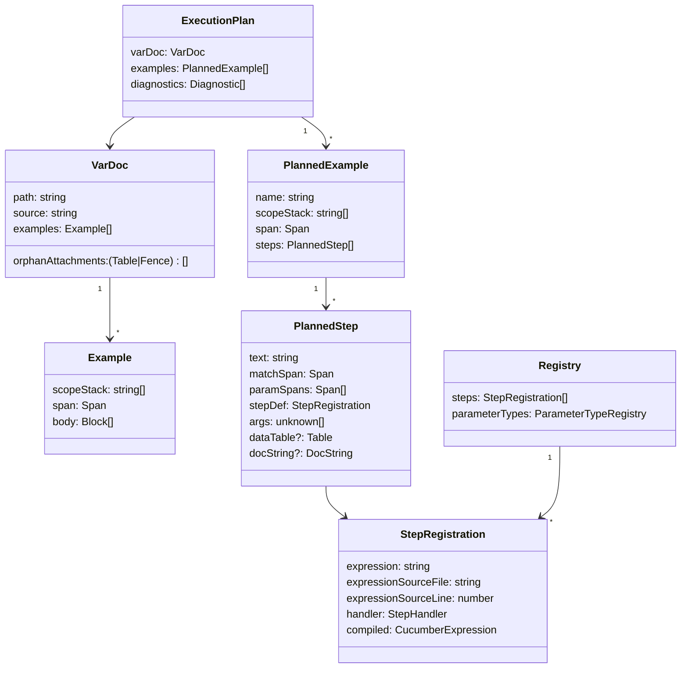
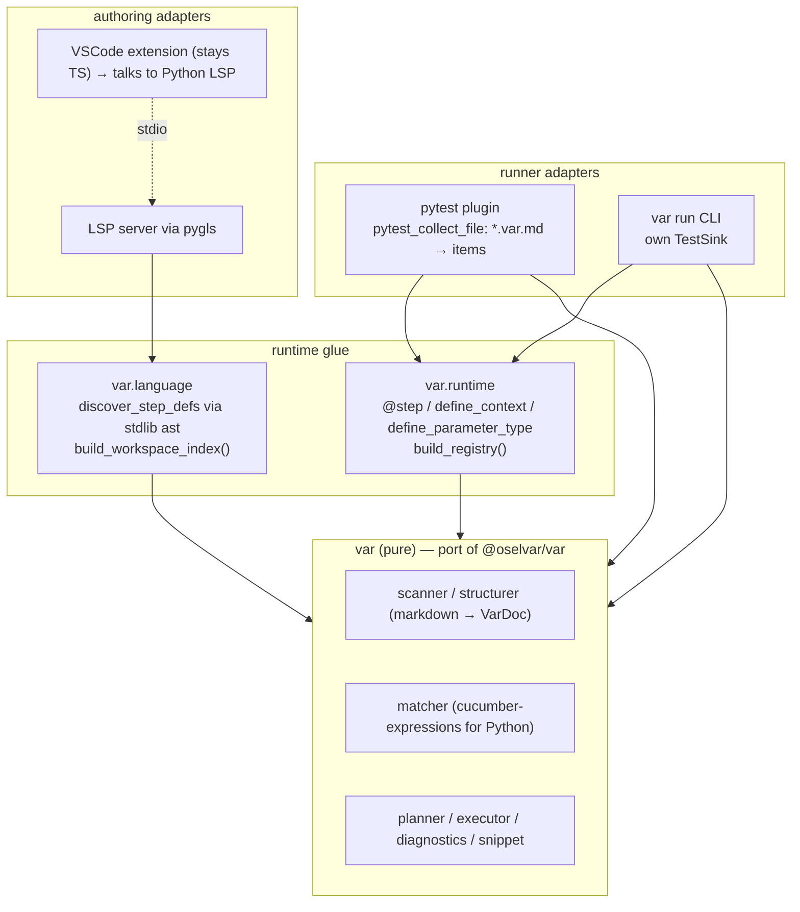

# Vár architecture (and a map for the Python port)

This document explains how the pieces of Vár fit together, and doubles as a
porting guide. The goal is to make the **seams** explicit — the small set of
pure data types and ports that everything else hangs off — so a Python port can
reproduce the same shape without re-deriving it from the TypeScript source.

> TL;DR. There are **two sides** to Vár, and they share one pure core.
>
> - **Side A — Authoring / static analysis.** Parse `.var.md` files *and* step
>   definition files, match them against each other, and produce an index.
>   Read-only, no execution. Powers the LSP, the VSCode extension, and `lint`.
> - **Side B — Running.** Import the step files (so handlers are real callables),
>   build an `ExecutionPlan`, and hand it to a **pluggable test runner** through
>   one tiny port. Powers the vitest adapter and the standalone `var run` CLI.
>
> The core (`@oselvar/var`) is pure functions over immutable data. All I/O —
> file reading, module loading, test-runner integration, editor glue — lives in
> the adapter packages and is wired in at the edges (hexagonal architecture).

---

## 1. Package map

The only external domain dependency of the core is
`@cucumber/cucumber-expressions` (cucumber expression compilation + parameter
types + snippet generation). Everything else in the core is hand-rolled and
pure.

---

## 2. The two sides

This is the mental model to hold onto. Both sides feed the **same matcher and
planner** in the core; they differ only in **how they obtain the registry of
step definitions** and **what they do with the result**.

**Why two registries?** The difference is the heart of the design:

| | Side A (static) | Side B (runtime) |
|---|---|---|
| Step files are | **parsed** as source text | **imported / executed** |
| Handlers are | absent (`EMPTY_HANDLER`) | real callables |
| Registry built by | `buildWorkspaceIndex` (`var-language`) | `buildRegistry` (`var-runtime`) |
| Used for | matching, completion, diagnostics, refactors | actually running examples |
| Side effects | none | importing user modules |

Both produce the *same* `Registry` type (compiled cucumber expressions +
parameter types), so the matcher and planner don't know or care which side
called them.

---

## 3. Side A in detail — parsing & indexing

This is the side the user described as *"the passing [parsing] of the source
files and the step definitions."* There are **two parsers** here, and they are
independent:

1. A **markdown parser** for `.var.md` (find examples, steps, tables, doc
   strings). Hand-rolled line scanner today; this is the natural home for a
   **PEG / Treetop-style grammar** in the port.
2. A **step-definition parser** for `.steps.ts` (find `step("…")` and
   `defineParameterType({…})` call sites and their handler signatures). Uses the
   **TypeScript compiler API** today; in Python this becomes the stdlib `ast`
   module.

Key types along this path (all `readonly`/immutable):

- `Block` → `Example` → `VarDoc` (`ast.ts`). Spans carry source offsets +
  line/col so editors can map matches back to exact ranges. `inlineMap` records
  how stripped inline markdown (backticks, emphasis) maps back to raw source
  offsets — essential for accurate highlight/rename ranges.
- `StepDef` / `ParameterTypeDef` (`var-language/step-defs.ts`) — the static view
  of a step file, including the handler's parameter list (for signature sync on
  rename).
- `WorkspaceIndex` (`var-language/index-workspace.ts`) — the single artifact the
  whole authoring side reads from.

The LSP wraps this in a `Store` (re-indexes on change) behind a `FileSystem`
port; the VSCode extension is a thin LSP client plus a couple of commands.

---

## 4. Side B in detail — running

This is *"the runner, which needs to be pluggable into any test runner."* The
crucial design point the user raised — *"a generic instruction API to run the
files, consistent across platforms but pluggable into whatever test runners are
available"* — is satisfied by **one immutable data structure plus one port**:

- The **instruction API** is the `ExecutionPlan` (pure data: examples → steps →
  resolved handler + args + attachments).
- The **plug point** is `TestSink.example(name, run)` — the *only* thing a
  runner adapter must implement. `executePlan` walks the plan and calls
  `sink.example(...)` once per example; the adapter decides what that means
  (a vitest `test()`, a pytest item, a queued closure, …).

Inside `executePlan` (see `execute.ts`):

- Each example becomes one `sink.example(name, asyncRun)`. The `asyncRun`
  closure runs the example's steps **in order**, awaiting each handler.
- **Context lifetime:** one context object **per stepfile per example**, created
  lazily via `createContext(stepFile)` on first use and shared by subsequent
  steps from that same stepfile. Different stepfiles get different contexts;
  different examples never share. This is how state is isolated without
  lifecycle hooks.
- **Attachments:** a trailing data table arrives as the last handler arg as
  `string[][]` (header row first); a doc string arrives as a plain string.
- **Diagnostics** (ambiguous match, orphan attachment) are pushed to
  `reporter.diagnostic` before any example runs.
- **Clickable failures:** on a thrown error, a synthetic stack frame pointing at
  the matched step's `file:line:col` in the `.var.md` is spliced in, so
  terminals render a cmd-clickable link.

The vitest adapter adds one more layer: a **vite plugin** turns every `.var.md`
into a virtual module that imports the step files and calls `runVarSource`. In
the port this is exactly the role a **pytest collection hook** plays — see §7.

---

## 5. Hexagonal view — ports & adapters

Everything that touches the outside world is a port implemented at the edge. A
porter's checklist is "implement these six ports for the target platform."

| Port | Defined in | Implemented by | Port-side responsibility |
|---|---|---|---|
| `TestSink` | `var/ports.ts` | vitest, `var run`, (pytest) | turn an example into a runner test |
| `Reporter` | `var/ports.ts` | vitest, CLI stderr, LSP | surface diagnostics |
| `createContext` | `var/execute.ts` (`ExecutePorts`) | `var-runtime` contextFactory | per-stepfile state factory |
| `ScannerPlugin` | `var/scanner.ts` | gherkin plugins (core, opt-in) | recognise extra block shapes |
| `StepDefScanner` | `var-language/scanner.ts` | TS compiler scanner | parse step source → `StepDef[]` |
| `FileSystem` | `var-lsp/file-system.ts` | node-fs, in-memory test fs | list/read/write source files |

---

## 6. Data model (the immutable contracts to reproduce)

These are the types a port must reproduce faithfully — they are the wire format
between stages. All fields are `readonly`; updates produce new values.

`plan(VarDoc, Registry) → ExecutionPlan` is the join: it runs the matcher per
text block, resolves overlaps/ambiguities, attaches trailing tables/fences to
the last matched step, derives each example's name from its first sentence, and
collects diagnostics. It is pure — same inputs, same plan.

---

## 7. Porting to Python

The architecture is deliberately language-agnostic: pure core + ports. The port
keeps the **same stages, the same immutable types, and the same two-sided
split**; only the adapters change.

### Tooling translation

| Concern | TypeScript today | Python port |
|---|---|---|
| Cucumber expressions | `@cucumber/cucumber-expressions` | `cucumber-expressions` (official PyPI package) |
| **Markdown parse** (`.var.md`) | hand-rolled line scanner in `scanner.ts` | PEG grammar — **Treetop-style** via `parsimonious`/`lark`, or port the line scanner verbatim. `ScannerPlugin` → grammar extension / pre-rule hook |
| **Step-def parse** (`.steps.py`) | TypeScript compiler API (`StepDefScanner`) | stdlib **`ast`** module: walk for `step("…")` / `define_parameter_type(...)` calls and decorator/handler signatures. Same `StepDefScanner` port shape |
| Module-scope registration | `var-runtime` mutable module state | a registry module; `@step("…")` **decorator** registers at import — a natural fit for Python |
| Per-stepfile context | `defineContext()` factory map | `define_context()` returning a typed `step`, keyed by module |
| Runner plug point | `TestSink.example` → `vitestTest` | `TestSink.example` → **pytest** collected item (`pytest_collect_file` / `pytest_pycollect_makeitem`) or `unittest` test |
| Per-`.var.md` wiring | vite virtual module | **pytest collection hook** turns each `.var.md` into a test file/module |
| File access | `node:fs` / in-memory | `pathlib` / in-memory `FileSystem` port |
| LSP server | `vscode-languageserver` | **`pygls`** |
| Editor extension | `@oselvar/var-vscode` | keep the TS extension; point its `serverModule` at the Python LSP |

### A note on "Treetop" / the two parsers

The user's instruction — *use Treetop for the parsing* — applies to the
**markdown side** (recognising examples, steps, tables, doc strings as a
grammar). Treetop itself is a Ruby PEG library; the Python equivalents are
`parsimonious`, `lark`, or `pyparsing`. The **step-definition side is a separate
parser** and should **not** use a text grammar — it parses real Python source,
so use the stdlib `ast` module (the analogue of today's TypeScript compiler
API). Keeping these two parsers behind their existing seams (`ScannerPlugin`
for markdown, `StepDefScanner` for step source) means each can evolve
independently.

### Suggested port order

1. **Core types + markdown parser** (`scan`/`structure` → `VarDoc`). Pure;
   easiest to test in isolation against the existing `.var.md` fixtures.
2. **Registry + matcher + planner** on top of `cucumber-expressions`. This
   unlocks both sides.
3. **Side B runtime**: `@step` decorator registry + `build_registry` +
   `execute_plan` with an in-memory `TestSink`; then the `var run` CLI.
4. **pytest adapter**: `TestSink` → collected items via a collection hook.
5. **Side A**: `discover_step_defs` (stdlib `ast`) + `build_workspace_index`.
6. **LSP** via `pygls`, reusing the existing VSCode extension.

Stages 1–3 give a runnable tool; 4 makes it idiomatic on the platform; 5–6 add
the authoring experience.
