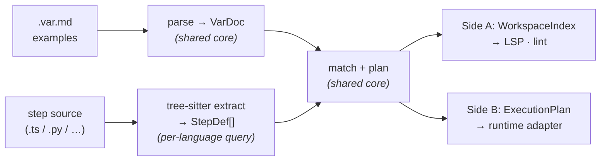
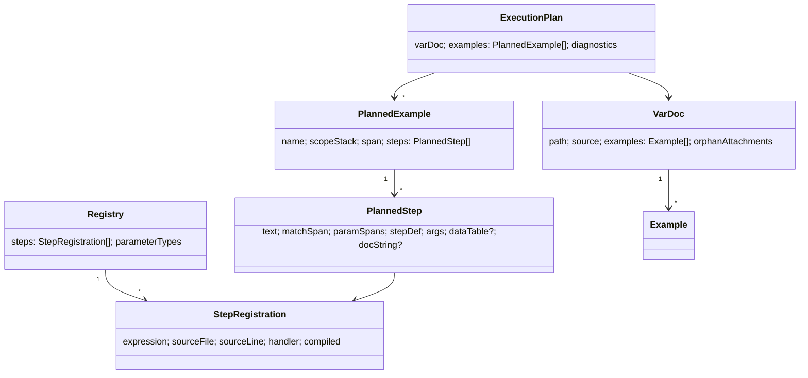

# Vár architecture (target state)

This describes how Vár **should** be structured to support many languages — not
how it is laid out today. It is the destination for the prefactoring work that
precedes the first non-TypeScript language (Python).

> **One thesis:** maximise the shared surface, minimise the per-language surface.
>
> There is **one** pure core — markdown parsing, matching, planning,
> diagnostics, LSP — written once and reused by every language. A new language
> contributes only three small things: a **tree-sitter query set** (to find step
> definitions in its source), a **code emitter** (to generate step snippets),
> and a **runtime adapter** (to actually execute its step functions). Everything
> else is shared.

The earlier version of this doc proposed *re-implementing* the core in each
language (port the markdown parser, the matcher, the planner; parse step files
with each language's native AST). We reject that: it multiplies the code that
must be kept consistent, and it forks the LSP. The whole point of the design
below is that those stay singular.

---

## 1. Two sides, one core

Both sides feed the **same matcher and planner**. They differ only in how they
obtain the step-definition registry, and what they do with the result.

| | **Side A — Authoring (static)** | **Side B — Running** |
|---|---|---|
| Step files are | **parsed** (tree-sitter), never executed | **executed** in their native runtime |
| Handlers are | absent (matching only) | real callables |
| Produces | a workspace index → matches + diagnostics | an `ExecutionPlan` → test-runner items |
| Powers | LSP, VSCode, `lint` | the vitest/pytest adapters, `var run` |
| Side effects | none | importing user modules |



The markdown parser, the cucumber-expression matcher, and the planner are
**language-agnostic and shared**. The only thing that knows about a host
language is step-definition *extraction* (Side A) and step-definition
*execution* (Side B).

---

## 2. The extraction seam (tree-sitter)

The single most important seam. Today `discoverStepDefs(path, source)` is a pure
function behind the `StepDefScanner` port (`var-language/scanner.ts`) — the
shape is already right; only the implementation is TypeScript-specific
(`ts.createSourceFile`).

**Target:** one extractor mechanism for *all* languages — **tree-sitter** — with
a small per-language query set replacing per-language parser code.

```ts
interface StepDefScanner {
  discoverStepDefs(path: string, source: string): ReadonlyArray<StepDef>
  discoverParameterTypes(path: string, source: string): ReadonlyArray<ParameterTypeDef>
}
```

A language is added by supplying:

- a **tree-sitter grammar** (`.wasm`), and
- a **query set** that locates `context("…")` / `action("…")` / `sensor("…")` /
  `defineParameterType(…)` call sites and their handler signatures,

and registering the scanner against that language's file globs. No new parser,
no new AST walker per language.

### Why wasm (`web-tree-sitter`), not native bindings

We run in the browser already (playground, VSCode-web, `run-worker`), and native
`node-tree-sitter` cannot. `web-tree-sitter` runs in **browser, Node, and Bun**
from one build, so we maintain **one** extractor everywhere. It is slower than
native, which is irrelevant at LSP scale (we parse step files, not whole
codebases). Two consequences leak through the port and are designed for, not
papered over:

1. **Async init.** `Parser.init()` and `Language.load(grammar.wasm)` are async,
   while the core is sync. So extraction happens at the **shell edge** (async:
   init → load → parse → immutable `StepDef[]`), and the sync core consumes the
   result. A `GrammarLoader` port supplies grammar bytes per environment (disk
   on Node/Bun, fetch in the browser).
2. **`StepDef` stays language-neutral.** The one host-specific field today is the
   handler param's `typeText` (a TS type as a string). Keep it an **opaque
   string** the per-language emitter owns; the core never interprets it.

---

## 3. The execution seam — and the one open decision

Static analysis needs no execution, so Side A is unambiguously shared. **Running**
a language's steps is the one thing that genuinely requires that language's
runtime — you cannot call a Python function from the JS process.

The core already expresses the boundary cleanly: `plan()` produces an
**`ExecutionPlan`** (pure data), and `TestSink.example(name, run)` is the only
port a runner implements. The open question is *where the plan is produced* for a
non-JS language:

- **Model A — shared core, thin native runner (recommended).** The JS/wasm core
  parses `.var.md`, matches, and emits a **serializable `ExecutionPlan`**
  (steps → `stepDefId` + args + locations). A thin Python runner maps
  `stepDefId → function` and executes. One parser, one matcher, one source of
  truth; the per-language code is tiny. Cost: a JS process in the loop at test
  time, and marshalling cucumber-expression arg values across the boundary.
- **Model B — native re-implementation.** Python re-parses `.var.md` and
  re-matches in-process (zero Node dependency, idiomatic `pytest`). Cost: a
  second markdown parser, matcher, and planner to keep byte-for-byte consistent,
  and the conformance suite (§5) becomes load-bearing rather than a safety net.

We lean **Model A**: it is the only option consistent with "one shared core, thin
adapters," and it keeps the markdown parser and matcher singular. Model B buys a
zero-Node developer experience at the price of duplicated cores. **This decision
should be locked before the refactoring begins** — it determines whether
`ExecutionPlan` must become a serialization contract, and whether a markdown
parser is ever written twice.

---

## 4. Ports a language must implement

Under the target model, adding a language is "implement these ports," and most
are already trivial or shared.

| Port | Role | Per-language? |
|---|---|---|
| `StepDefScanner` (tree-sitter query set) | find step defs in source | **yes** — a query set + grammar |
| `SnippetEmitter` | render a step snippet as host source | **yes** — selection-only, no keyword heuristics |
| `TestSink` | turn an `ExecutionPlan` example into a runner item | **yes** — the runtime adapter |
| `GrammarLoader` | supply grammar `.wasm` bytes | per-environment, not per-language |
| `Reporter` | surface diagnostics | shared/edge |
| `FileSystem` | list/read/write source | shared/edge |
| markdown scanner · matcher · planner · LSP | everything else | **shared core** |

---

## 5. Proving consistency: the conformance suite

Because the static layers are shared, most "consistency" is free — there is only
one matcher. What must be proven per language is the **extraction seam** (and,
under Model B, the duplicated core).

A **language-agnostic conformance suite** parametrised over every supported
language:

- **Per-language fixtures, shared expectations.** Each case has one
  language-neutral expectation (e.g. "this source defines `a {int} cukes` at
  range R; completion at P offers X"). Each language provides the equivalent
  step-definition source; the harness asserts the **same** expectation against
  every language.
- **Golden snapshots.** Extraction output and LSP responses are serialised. A
  shared-layer change that alters behaviour must update every language's goldens
  in one commit, so accidental divergence is visible in review.
- **Coverage matrix.** A language is "supported" only when green across
  extraction, matching, ambiguity diagnostics, completion, go-to-definition,
  document symbols, semantic tokens, and snippet round-trips. Gaps are logged,
  not silently skipped.

Stand this harness up with TypeScript as the only column *before* Python, so
Python slots in as column two rather than a new test framework.

---

## 6. Data model (the shared contracts)

These immutable types are the wire format between stages and are reproduced
**once**, in the shared core.



`plan(VarDoc, Registry) → ExecutionPlan` is the join: it matches each text block,
resolves ambiguities, attaches trailing tables/fences to the last matched step,
derives example names, and collects diagnostics. It is pure. Under Model A,
`ExecutionPlan` additionally becomes the **serializable contract** shipped to a
native runner (handlers replaced by `stepDefId`s).

---

## 7. What this means for the refactoring (preview)

The prefactoring that makes the first language drop in — each step improves trunk
on TypeScript alone, before any Python exists:

1. **Reimplement the TS `StepDefScanner` on tree-sitter** (web-tree-sitter + TS
   grammar), keeping the port signature and making existing tests pass unchanged.
   Dogfood the seam on the language we already have.
2. **Move extraction to the async shell edge**; add the `GrammarLoader` port.
3. **Make `StepDef` neutral** — `typeText` becomes opaque.
4. **Extract a `SnippetEmitter` port** from the TS-emitting snippet code.
5. **De-hardcode file patterns** into per-language config (`.var.md` stays neutral).
6. **Lock Model A vs B** (§3); if A, make `ExecutionPlan` serializable.
7. **Stand up the conformance harness** with TS as the only column.

A detailed, sequenced refactoring plan follows separately.
